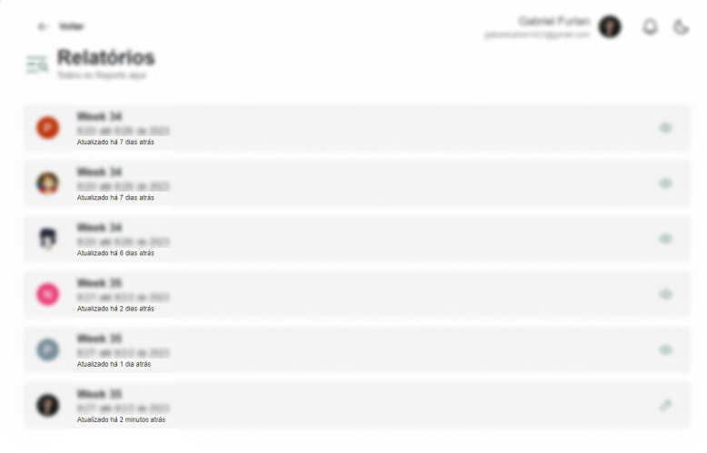
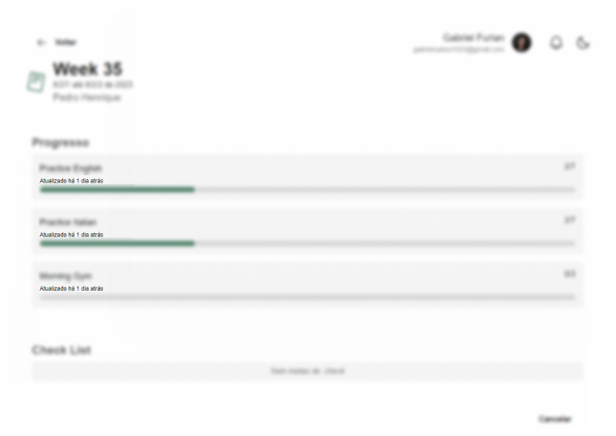

## Implementações

Agora é possível visualizar o tempo decorrido desde a última atualização de um Report ou de uma meta.

### Exemplos

#### Reports

#### Metas

### Autores

Prototipação: [Eller Gustavo](https://github.com/ellergus) 
Codificação: [Gabriel Garcia](https://github.com/GabrielGarcia190) 
Teste de Qualidade: [Gabriel Furlan](https://github.com/gabrielfurlan-dev)