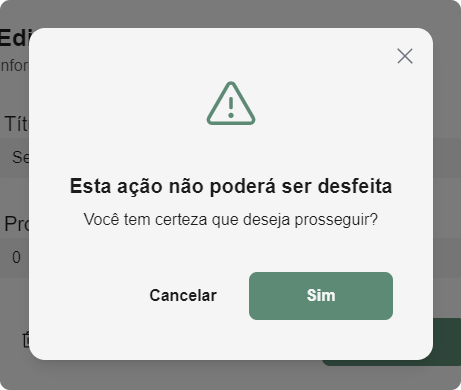
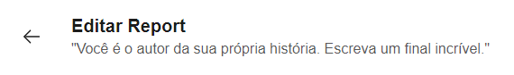
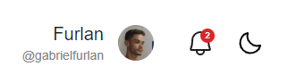
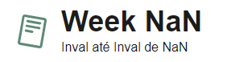

## Implementações e correções

### Implementações

- Adicionado confirmação de eliminação de metas/progresses.

- Adicionado frases motivacionais na barra de navegação da página de Editar/Adicionar os Reports;

---

### Refinamentos

- Substituído a exibição do e-mail pelo nome de usuário no botão de perfil;

- Removido o caractere "@" do `placeholder` do campo de Username em Edição/finalização do cadastro. Tal implementação estava causando confusões anteriormente;
- Removido o ícone da barra de navegação superior das páginas, exceto a de inicio;

 

- Adicionado o número de notificações não lidas.

---

### Correções

- Corrigido validação para Reports modificados ao tentar sair da página de Edição/Adição/Visualização dos Reports;
- Corrigido navegação de retroceder páginas de Editar/Visualizar/Adicionar os Reports;
- Corrigido intervalo da semana como "não identificado" no cabeçalho dos Reports;

--- 

### Autores

Codificação: [Gabriel Furlan](https://github.com/gabrielfurlan-dev) 
Teste de qualidade: [Gabriel Garcia](https://github.com/GabrielGarcia190)