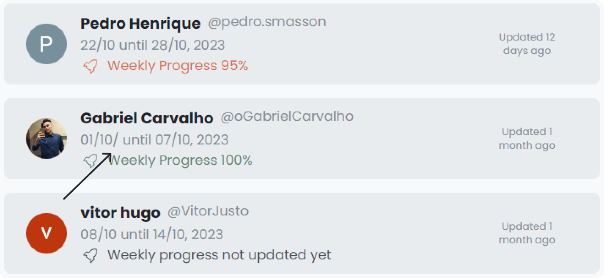

## Correções e melhorias

- Corrigido bug de exibição da barra `("/")` no campo de período do relatório.

- Aprimorada validação para permitir apenas um relatório por semana, corrigindo também o ícone do modal associado.

- Resolvido bug de duplicação na criação de relatórios.

- Ajustados botões na página inicial para melhorar a consistência e usabilidade.

- Adicionada limitação de 5 notificações carregadas.

---

Essas correções foram implementadas para melhorar a estabilidade e a experiência do usuário. Recomenda-se testar as alterações e relatar qualquer problema adicional.

