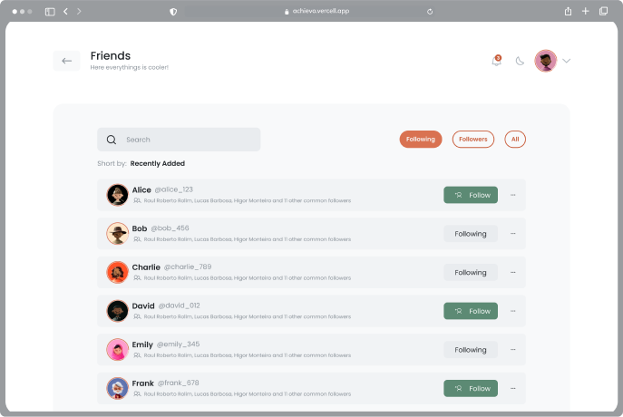

## Added "Friends" Functionality

- Created a new dedicated screen for friends, enabling a more interactive and social experience on the platform.

### Follow and Unfollow Features:

- Implemented the follow and unfollow functionalities, allowing users to follow or unfollow others directly on the Friends screen.

### Refactoring of the Report Listing Screen:

- The report listing screen has been significantly refactored to better integrate with the new Friends functionality.

### Enhanced Filtering Features:

- Added filters to view:
    - Reports from followers.
    - Reports from people you are following.
    - Reports from all users.

### User Search Input:

- Introduced a search field enabling users to find others by both name and username, providing an efficient way to discover friends on the platform.

---

These updates in version 0.2.0 aim to improve social interaction on the platform by introducing the Friends feature and enhancing integration with the report listing screen. We recommend exploring the new features and providing feedback on the user experience.

### Authors

Coding: [Gabriel Furlan](https://github.com/gabrielfurlan-dev) 
Prototyping and Quality Testing: [Gabriel Carvalho](https://github.com/oGabrielCarvalho)