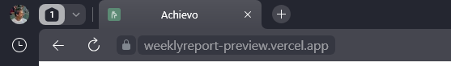
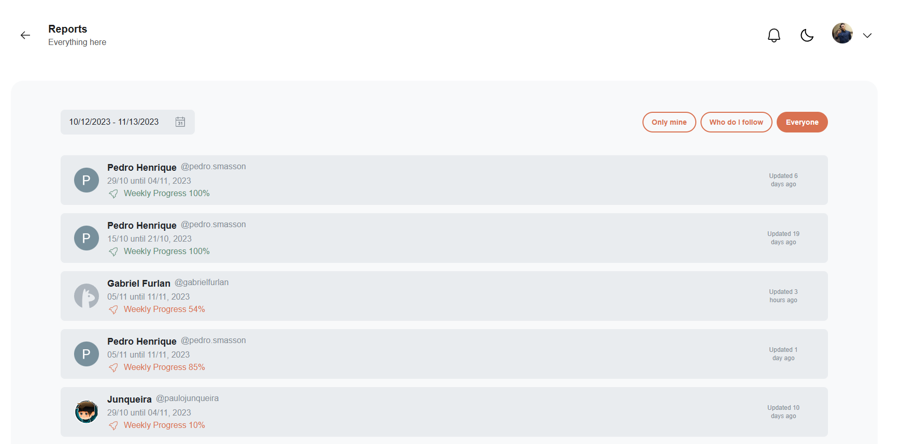
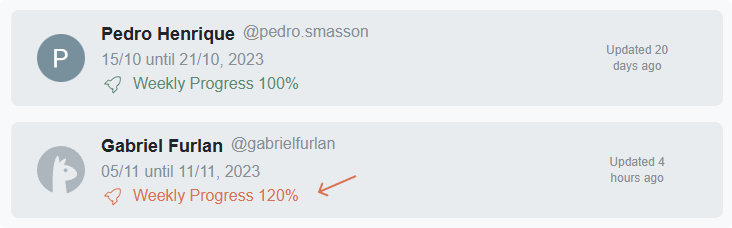

## Implementations and Fixes

### Interface Enhancements:

- Fixed the Dark Theme button hover for a more consistent and user-friendly experience.

#### Before and After
>
>

### Navigation Improvements:

- Added an icon and page name for clearer and more intuitive identification.

### Image Loading Treatment:

- Removed image loading to provide faster and more efficient rendering.

### Simplification in Report Listing:

- Removed the author's description when listing reports, simplifying the presentation of information.

### Friend Screen Enhancements:

- Added hover effect on follow and following buttons for better visual feedback.

### Correction of Progress Above 100%:

- Fixed progress calculation to ensure it does not exceed 100% for a more accurate representation.

---

These improvements in version 0.2.1 aim to enhance usability, fix minor interface issues, and ensure a smoother experience for users. It is recommended to explore the updates and report any feedback or identified issues.

### Autores

Coding: [Gabriel Furlan](https://github.com/gabrielfurlan-dev) 
Quality Testing: [Gabriel Carvalho](https://github.com/oGabrielCarvalho)

